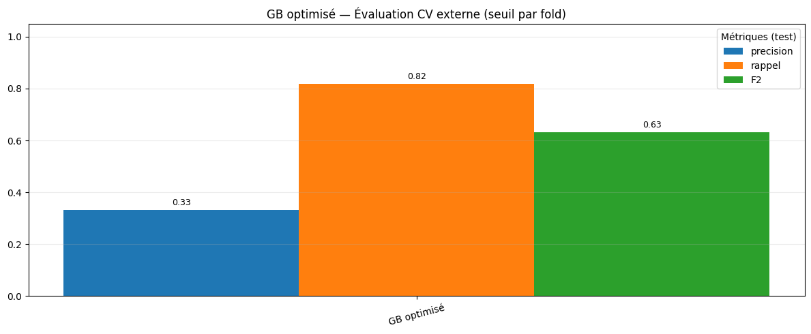
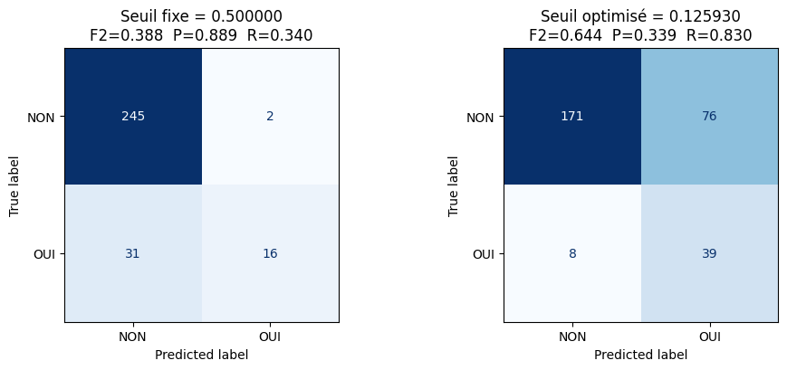

# Évaluation

## Méthodologie

- **Split train/test** avec stratification sur `a_quitte_l_entreprise`.
- Sur la partie train :
  - **Validation croisée StratifiedKFold** (k=5).
  - Pour chaque fold et chaque modèle, on :
    1. Entraîne un pipeline complet (préprocesseur + modèle).
    2. Optimise le **seuil F2** sur un sous-split de validation via `precision_recall_curve`.
    3. Applique ce seuil pour calculer les métriques sur le fold.
- Le modèle retenu est le **GradientBoostingClassifier** avec seuil optimisé.

Seuil final sélectionné :

- **Seuil F2 optimal** : `0.12593` (moyenne sur les folds).

---

## Métriques (validation croisée)

Comparaison des principaux modèles testés (seuil optimisé par modèle) :

- **GradientBoostingClassifier**
  - F2 moyen : **0.65** (≈ 0.6453)
  - Précision moyenne : **0.38** (≈ 0.38)
  - Rappel moyen : **0.79** (≈ 0.785)
  - Seuil moyen : **0.126**
  - F2_std : ~0.045

- **LogisticRegression**
  - F2 moyen : ~0.64
  - Précision moyenne : ~0.41
  - Rappel moyen : ~0.74
  - Seuil moyen : ~0.51

- **RandomForestClassifier**
  - F2 moyen : ~0.60
  - Précision moyenne : ~0.37
  - Rappel moyen : ~0.72
  - Seuil moyen : ~0.17

👉 Le **GradientBoostingClassifier** avec seuil optimisé est légèrement meilleur en F2, et surtout en **rappel**, ce qui est cohérent avec l’objectif métier (ne pas rater les cas à risque).

---

## Seuil par défaut vs seuil optimisé

Sur un scénario illustratif (test set) :

- **Seuil par défaut (0.5)**  
  - Faux négatifs (FN) : **31**  
  - Beaucoup de départs réels ne sont pas détectés → **rappel faible**.

- **Seuil optimisé (0.12593)**  
  - Faux négatifs (FN) : **8**  
  - Le nombre de faux négatifs est **divisé par ~4**.  
  - La précision diminue, mais le **rappel augmente fortement**.

---

## Matrice de confusion

La matrice de confusion complète (TN, FP, FN, TP) est tracée dans le notebook (voir figures ci-dessous) pour le seuil optimisé :

-

Points clés :

- Importante **réduction des FN** par rapport au seuil 0.5.
- Légère augmentation des FP, mais acceptable vis-à-vis du contexte métier (mieux vaut sur-alerter que rater un départ probable).

---

## Analyse d’erreurs

- Les **faux négatifs** restants correspondent souvent à :
  - des profils “intermédiaires” (ni très satisfaits, ni très insatisfaits),
  - des historiques atypiques (peu d’expériences, mais très bon scoring ailleurs),
  - des cas borderline proches du seuil.

- Les **faux positifs** sont majoritairement des employés :
  - avec signaux de risque (ancienneté faible, satisfaction moyenne/basse, poste exposé),
  - mais qui, dans les faits, n’ont pas quitté l’entreprise.

👉 Dans ce contexte, l’arbitrage a été fait en faveur du **rappel** : on accepte davantage de faux positifs pour réduire fortement le nombre de départs non détectés.
